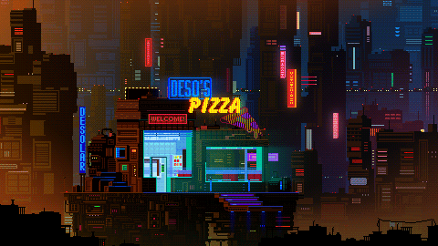

# Olá, eu sou Bruno Silva 👋

  

### Futuro Desenvolvedor Full Stack

Estudante de Análise e Desenvolvimento de Sistemas na Unisenai, 23 anos, apaixonado por tecnologia e criação de soluções digitais inovadoras.

- **1+ Anos de Estudo**
- **10+ Projetos Pessoais**

  

---

## 🛠️ Habilidades Técnicas

Minhas habilidades incluem:

| Categoria    | Habilidades                               |
| :----------- | :---------------------------------------- |
| Linguagens   |     |
| Banco de Dados |                                      |
| Ferramentas  |                        |
| Conceitos    | Vibe Code, Responsive Design, Performance, Learnig PHP |

---

- **Análise e Desenvolvimento de Sistemas**
  - Unisenai (2025 - 2027)
  - Formação focada em desenvolvimento de software, banco de dados, engenharia de software e metodologias ágeis.

## 📊 Estatísticas do GitHub

  
  

---

- **Email**: brunoasrs@gmail.com
- **Localização**: Joinville, SC - Brasil
- **Instituição**: Unisenai - ADS

[Visite meu portfólio](https://brunolart.github.io/brunosilva.github.io/)

---

  
  

